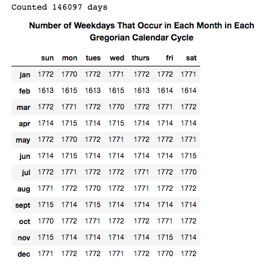
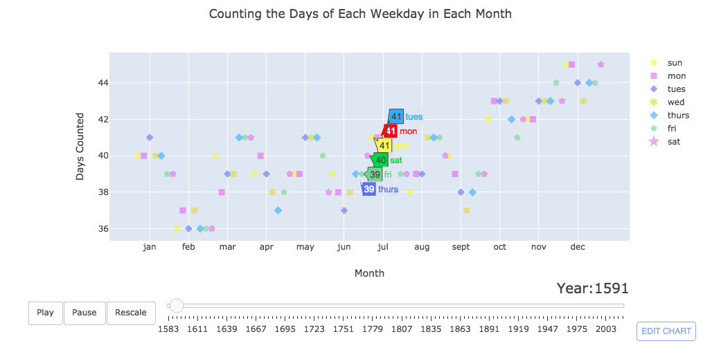

# Days-of-the-Week-of-each-Month-through-the-Years
Looking into the number of weekdays that occur in each month throughout a Gregorian Cycle (400 years).

Notebook can be viewed here: https://nbviewer.jupyter.org/github/Album/Days-of-the-Week-of-each-Month-through-the-Years/blob/master/weekday-counter.ipynb

**Table of Number of Weekdays in each Month in a Gregorian Cycle:**

**Screenshot of Animated Plot of Weekday Counter:**

